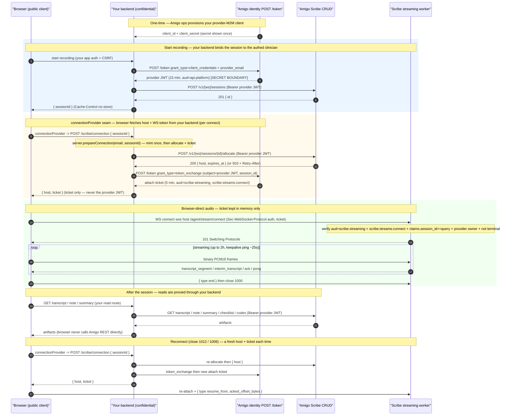

# Scribe streaming — customer integration guide

This is the single document a customer engineer follows to go from **zero → a
working in-person Scribe recording** using `@amigo-ai/scribe-typescript-sdk`.

It integrates in-person Scribe streaming with the **split-trust** model: your
**backend** is a confidential machine-to-machine (M2M) client that holds the
secret and mints tokens; your **browser** runs `@amigo-ai/scribe-typescript-sdk` and streams
audio with only a short-lived, single-session **attach ticket**. The secret and
the provider JWT never leave your server.

> **Audience:** an external customer building their own product on the Amigo
> Scribe API. If you are integrating the first-party Amigo web app, that path
> uses a same-origin BFF and is out of scope here.

The SDK ships **two clients** that map onto this split:

- **`ScribeServerClient`** — the confidential, backend half. Holds the M2M
  secret; mints per-clinician provider tokens (act-as-by-email), does session
  CRUD + allocate, and mints WS-only attach tickets. Exposes `allocate` and
  `mintAttachTicket` separately, plus a `prepareConnection` helper that returns
  the browser-safe `{ host, ticket }` bundle in one call. **Server-side only —
  never import it into a browser bundle.**
- **`ScribeStreamClient`** — the public, browser half. Given a host + attach
  ticket (fetched from your backend), it manages the WebSocket audio connection:
  attach, PCM16 send, keepalive, and resumable reconnect. It never holds a
  provider credential.

---

## 1. Architecture and trust boundaries

There are two trust tiers. Everything privileged lives on your backend; the
browser only ever holds a credential good for one thing: attaching to one
session's WebSocket.

|                        | **Your backend** (confidential)                                                                                                            | **Your browser** (public)                                                              |
| ---------------------- | ------------------------------------------------------------------------------------------------------------------------------------------ | -------------------------------------------------------------------------------------- |
| Holds                  | `client_id` + `client_secret`; per-clinician provider JWT (15 min)                                                                         | one **attach ticket** (WS-only, ~5 min)                                                |
| Auth to Amigo          | `POST /token` `grant_type=client_credentials` + `provider_email` → provider JWT                                                            | `Sec-WebSocket-Protocol: "auth, <attach-ticket>"` on WS attach                         |
| Token audience / scope | `https://api.platform.amigo.ai` / `scribe:sessions:write` (+ `scribe:sessions:read_own`, `scribe:notes:rw_own`)                            | `scribe-streaming` / `scribe:streams:connect` **only**                                 |
| Can do                 | create session, allocate a host, mint attach tickets, read transcript / note / summary / checklist / codes for its own provider's sessions | attach to **one** WS session, stream PCM16 up, receive that session's transcripts down |
| Cannot do              | (full provider scope for its own sessions)                                                                                                 | any REST call (audience rejected); attach to any other session; mint further tickets   |
| Network                | server→server to `scribe.platform.amigo.ai` + `api.platform.amigo.ai` (no CORS)                                                            | WS-only to `wss://<gameserver>.actors.platform.amigo.ai`                               |

**The three requests your backend makes to Amigo per recording:**

1. **Mint a per-clinician provider token** — `grant_type=client_credentials` +
   `provider_email` (act-as-by-email). The email is the logged-in clinician's,
   taken from _your_ app session — never supplied by the browser.
2. **Create + allocate** — `createSession` then `allocate` (via the SDK's
   `ScribeClient` or REST), using the provider token as the bearer.
3. **Mint the browser's attach ticket** — `grant_type=token_exchange`, exchanging
   the provider token for a session-bound, WS-only ticket. Return **only**
   `{ ticket, expiresAt }` (plus the `host`) to the browser.

The browser then attaches its WebSocket directly to the streaming host with the
ticket, streams PCM16 up, and receives transcript frames down.

### Recommended architecture: browser talks directly to Amigo **only** for the WebSocket

The browser makes exactly **one** direct connection to Amigo — the streaming
**WebSocket** (`wss://<host>/agent/stream/connect`), authed with the short-lived
attach ticket. **Everything else goes through your backend:**

- **Browser → your backend → Amigo REST** for all CRUD: create-session,
  allocate, and every read (get-transcript / note / summary / checklist / codes).
  Your backend attaches the provider JWT as the bearer and proxies the result
  back. The browser **never** calls the Amigo REST API directly and **never**
  holds the provider JWT.
- **Browser → Amigo WebSocket (direct)** with the attach ticket only.

This keeps the provider credential entirely server-side and means Amigo's REST
API needs no CORS configuration for your browser origin (the only cross-origin
link is the WS, which is not subject to CORS — the attach ticket is its
authorization boundary). Concretely, the browser SDK's `connectionProvider` seam
calls _your_ backend route (not Amigo), and any transcript/artifact display in
the browser fetches from _your_ read routes, which proxy to Amigo.

### Sequence diagram



**Trust boundaries.** `[SECRET BOUNDARY]` marks your backend: the
`client_secret` and every provider JWT live only there. Everything the browser
receives is single-session and short-lived. Note the two distinct lifetimes:
the **allocation lease** (`expires_at`, ~2 h) and the **attach window**
(`expiresAt`, ~5 min).

---

## 2. Prerequisites and setup

### 2.1 A provider-M2M client (obtained once)

Your backend authenticates to Amigo with a **confidential provider-M2M client**:
a `client_id` + `client_secret` scoped to your **workspace**. Amigo ops
provisions this for you initially (self-serve provisioning is a later addition).

When provisioned you receive:

- `client_id` — non-secret identifier.
- `client_secret` — **shown once**. Store it in your server-side secret manager;
  never commit it, log it, or ship it to the browser.
- `workspace_id` — the workspace all your sessions live in.
- `allowed_scopes` — by default
  `{ scribe:sessions:write, scribe:sessions:read_own, scribe:notes:rw_own }`,
  which covers the full CRUD + artifact path.

The client is **workspace-scoped**: it can act as any clinician who holds an
active Scribe access grant in that workspace (see below), and can only touch
sessions owned by those clinicians.

### 2.2 Scribe access grants (per clinician)

The M2M client cannot invent clinicians. Each clinician who will record must
have an **active Scribe access grant** in your workspace, keyed by their email.
The grant is the authority the act-as-by-email mint resolves against.

- Grants are provisioned by Amigo ops / a workspace admin (self-serve
  management endpoints are being added).
- Only an **active** grant mints a token. Unknown / pending / revoked emails
  fail closed with `invalid_target` (see §3.3 and Troubleshooting).

### 2.3 Scopes

| Scope                      | Held by                        | Purpose                                      |
| -------------------------- | ------------------------------ | -------------------------------------------- |
| `scribe:sessions:write`    | backend provider JWT           | create session, allocate                     |
| `scribe:sessions:read_own` | backend provider JWT           | read session + transcript + artifacts        |
| `scribe:notes:rw_own`      | backend provider JWT           | generate / finalize note, summary, checklist |
| `scribe:streams:connect`   | browser attach ticket **only** | attach to one session's WebSocket            |

`scribe:streams:connect` is a **non-REST** scope on the `scribe-streaming`
audience: an attach ticket is rejected at every REST endpoint, and a REST
provider JWT is rejected at the WebSocket. The two credentials are not
interchangeable.

### 2.4 Visit type and note template

Session creation requires a canonical `visit_type` that resolves to a supported note template for the workspace. Confirm that configuration during provisioning, even though the generated request schema makes the field optional. General session creation is in-person; Zoom sessions use the separate Zoom-create workflow. PATCH cannot change session mode.

### 2.5 Install the SDK

Both the backend and the browser import from the same ESM-only package:

```bash
npm i @amigo-ai/scribe-typescript-sdk
```

Requires Node.js ≥ 20 on the backend, and any modern browser (`fetch` +
`WebSocket`) on the client.

---

## 3. Backend integration

Your backend does the mints, CRUD, and ticket exchange — all server-side; the
browser never sees a provider JWT or the client secret. **`ScribeServerClient`
encapsulates all of it** (see the example in §5.1); you rarely need to hand-roll
the raw HTTP. The subsections below document the underlying wire shapes for
reference (and for non-SDK backends) and map each to its `ScribeServerClient`
method:

| Step                     | `ScribeServerClient` method           | Raw wire    |
| ------------------------ | ------------------------------------- | ----------- |
| provider token (act-as)  | `mintProviderToken(email)`            | §3.1        |
| create session           | `createSession(email, input?)`        | §3.2        |
| allocate host            | `allocate(email, sessionId)`          | §3.2        |
| attach ticket            | `mintAttachTicket(email, sessionId)`  | §3.3        |
| host + ticket (one call) | `prepareConnection(email, sessionId)` | §3.2 + §3.3 |

### 3.1 Mint a per-clinician provider token (act-as-by-email)

`ScribeServerClient.mintProviderToken(email)` — under the hood,
`POST {identityBaseUrl}/token`, **form-urlencoded**:

| field            | value                                                  |
| ---------------- | ------------------------------------------------------ |
| `grant_type`     | `client_credentials`                                   |
| `client_id`      | your M2M client id                                     |
| `client_secret`  | your M2M client secret                                 |
| `provider_email` | the logged-in clinician's email (lower-cased, trimmed) |

Response: `{ access_token, token_type, expires_in, scope }`. The `access_token`
is a **provider JWT** (`aud=https://api.platform.amigo.ai`, ~15 min) whose `sub`
is the clinician's provider entity. Use it as the bearer for create/allocate and
as the `subject_token` for the attach-ticket exchange.

> **Never** take `provider_email` from the browser. Derive it from your own
> authenticated app session for the clinician who is recording.

**Caching the provider token.** `ScribeServerClient` caches the provider JWT
**in memory per clinician email** and re-mints shortly before expiry, so calling
`mintProviderToken` / `allocate` / `mintAttachTicket` / `prepareConnection`
repeatedly does not re-mint redundantly (call `clearTokenCache()` after a secret
rotation). If you run multiple backend instances and want a shared cache, store
the token in a key-value store **encrypted with a symmetric key**, keyed by
`(workspace, provider_email)`, and respect its TTL. Never persist it unencrypted
and never expose it to the browser. Do **not** cache the attach ticket — it is
short-lived (~5 min) and minted fresh per WS (re)connect (§3.3).

### 3.2 Create and allocate

`ScribeServerClient.createSession(email, input?)` and
`allocate(email, sessionId)` (or `ScribeClient` / raw REST):

- `createSession` → `POST /v1/{workspace_id}/sessions` → `201` with `{ id, ... }`.
- `allocate` → `POST /v1/{workspace_id}/sessions/{session_id}/allocate` → `200`
  `{ host, expires_at }` (returned as `{ host, expiresAt }`). On capacity
  exhaustion / per-session cooldown it returns `503` with a `Retry-After` header
  (surfaced by the SDK as `ServiceUnavailableError.retryAfterSeconds`).

> **The browser never allocates.** Allocation happens on your backend (the
> browser SDK's `connectionProvider` / `allocateProvider` seams call _your_
> routes, which call `ScribeServerClient`). `allocate` has a per-session
> cooldown, so allocate **once** per (re)connect — don't pre-allocate and then
> let the SDK allocate again, or the second call `503`s. `prepareConnection`
> does exactly one allocate + one ticket mint, so it's the safe per-connect call.

### 3.3 Mint the browser's attach ticket

`ScribeServerClient.mintAttachTicket(email, sessionId)` — under the hood,
`POST {identityBaseUrl}/token`, **form-urlencoded**:

| field           | value                                        |
| --------------- | -------------------------------------------- |
| `grant_type`    | `token_exchange`                             |
| `subject_token` | the provider JWT from §3.1                   |
| `session_id`    | the Scribe `session_id` from `createSession` |

Response: `{ access_token, token_type, expires_in }`. The `access_token` is the
**attach ticket**: `aud=scribe-streaming`, scope `scribe:streams:connect` only,
bound to that one `session_id` / workspace / provider, 5-min TTL (`expires_in`
300). Return **only** the ticket (and its expiry) to the browser.

> The server sets the audience and scope for you. If you send them explicitly
> they must match exactly (`audience=scribe-streaming`, `scope=scribe:streams:connect`),
> and `subject_token_type`, if supplied, must be
> `urn:ietf:params:oauth:token-type:access_token`. The minimal form above (just
> `grant_type` + `subject_token` + `session_id`) is sufficient.

**Anti-escalation:** a ticket can never be exchanged again — a `scribe-streaming`
subject is rejected. Only a full provider JWT can mint a ticket.

### 3.4 Fail-closed behaviors to handle

- **`invalid_target` (400)** on the `client_credentials` mint → the clinician has
  no active grant in your workspace (unknown / pending / revoked /
  cross-workspace). Surface a clean "this clinician isn't enabled for Scribe"
  error; do not retry blindly.
- **`invalid_scope` / `invalid_request` (400)** → a malformed exchange request
  (see Troubleshooting).
- **`503` + `Retry-After`** on `allocate` → Fleet at capacity or cooldown; back
  off for the indicated seconds and retry.

---

## 4. Browser integration (`@amigo-ai/scribe-typescript-sdk`)

The browser uses `ScribeStreamClient` — the recording-independent WebSocket
client. It attaches with an attach ticket, streams caller-supplied PCM16, and
handles keepalive + resumable reconnect. **It never holds a provider credential
or mints tickets.** You wire it to your backend through one of three seams (all
re-invoked on every (re)connect so the ticket is always fresh):

- `connectionProvider(sessionId)` → `{ host, ticket, ... }` — **preferred**; one
  call to your backend route that returns `ScribeServerClient.prepareConnection`'s
  bundle.
- `allocateProvider(sessionId)` → `{ host, expiresAt }` **and**
  `ticketProvider(sessionId)` → `{ ticket, expiresAt? }` — the split seams (two
  routes), if you'd rather keep allocate and ticket separate.
- static `host` + `ticket` — a one-shot connection with values you already hold
  (reused verbatim on reconnect, so not reconnect-safe once the ticket expires).

**How the ticket becomes the WS auth token.** The browser never mints the ticket
— it gets it from your backend through the configured seam. On `connect()` the
client (1) resolves `{ host, ticket }` from the seam, then (2) opens
`new WebSocket("wss://<host>/agent/stream/connect?session_id=…", ["auth", <ticket>])`.
A WebSocket upgrade can't carry an `Authorization` header, so the ticket rides as
the **second value of the `Sec-WebSocket-Protocol` header** (after the literal
`"auth"`) — the SDK builds this for you. The worker reads the ticket from that
subprotocol, verifies `aud=scribe-streaming` + `scribe:streams:connect` +
`claims.session_id == the query session_id` + provider ownership, and accepts (or
closes `4001`/`4004`/`4009`). Because both seams run on every connect, the token
is always freshly minted for the connection it authorizes — including the very
first one.

Events: `onTurn(segment)`, `onStateChange(state)`, `onReconnect()`,
`onError(err)`. State machine (`ScribeStreamState`): `idle → connecting →
streaming → paused → reconnecting → ended | failed`.

Reconnect is automatic on close `1012` (try-again) and `1006` (abnormal), and
**never** on `1000` (clean) / `4001` (auth) / `4009` (terminal). On reconnect the
client re-invokes the connection seam (fresh host + fresh ticket), re-attaches
the same session, sends `resume_from{acked_offset_bytes}`, and resends only the
unacked ring-buffer audio.

> **Audio capture.** `ScribeStreamClient` has **no** mic code — you feed it PCM16
> via `sendAudio(ArrayBuffer | Uint8Array)`. The exported `ScribeRecorder` owns
> `getUserMedia` → PCM16 capture and drives the client; see §7. Use the lower-level
> client when you supply your own 16 kHz mono, little-endian PCM16 stream.

### The WebSocket is browser-direct

`ScribeStreamClient` runs **in the browser** and opens the WebSocket **directly to
the allocated Amigo gameserver** (`wss://<host>.actors.platform.amigo.ai`) — that
socket is the one browser↔Amigo hop (§1). Only REST and the two mints are proxied
through your backend. You don't need any extra plumbing for the direct
connection; using `ScribeStreamClient` _is_ how the browser connects directly.

### Low-level primitives (build your own client)

The socket lifecycle — subprotocol handshake (`["auth", ticket]`), app-level
keepalive, reconnect/backoff, ring-buffer resend, and `resume_from` — is
encapsulated **inside `ScribeStreamClient`**; there is **no** separate exported
"open the socket" function, and for almost all customers `ScribeStreamClient` is
the right layer. If you must drive the socket yourself (e.g. a non-browser
runtime or a custom state machine), the SDK exports the full wire contract so you
don't have to reverse-engineer it:

- `buildWsUrl(host, sessionId)` and `WS_CONNECT_PATH` — the exact attach URL.
- `CLIENT_FRAME` / `SERVER_MESSAGE` / `CLOSE_CODE` enums and every frame type
  (`ResumeFromFrame`, `TranscriptSegmentFrame`, `AckFrame`, `PongFrame`, …).
- `shouldReconnect(code)`, `backoffDelayMs(attempt)`, `RECONNECT`,
  `KEEPALIVE_INTERVAL_MS` — the reconnect + keepalive policy.
- `AudioRingBuffer` (resend-unacked), `normalizeTurn`, `transcriptReducer` — the
  buffering + transcript-assembly helpers.

You still open the socket yourself as
`new WebSocket(buildWsUrl(host, sessionId), ['auth', ticket])`, sourcing `host`
and `ticket` from your backend exactly as the seams do. If you only need to swap
the **transport** (not the logic), prefer `ScribeStreamClient`'s
`webSocketFactory` option (typed `WsLike`) to inject a custom `WebSocket`
implementation while keeping the client's connection handling.

---

## 5. End-to-end code examples

### 5.1 Backend (framework-agnostic Node / TypeScript)

`ScribeServerClient` does the mints + CRUD + ticket exchange. Construct it once
with your workspace + M2M credentials; every method takes the clinician's email
(from YOUR authenticated app session — never the browser).

```ts
import { ScribeServerClient } from '@amigo-ai/scribe-typescript-sdk'

const server = new ScribeServerClient({
  identityBaseUrl: 'https://api.platform.amigo.ai', // identity /token (mints)
  scribeBaseUrl: 'https://scribe.platform.amigo.ai', // Scribe CRUD
  workspaceId: process.env.AMIGO_WORKSPACE_ID!,
  clientId: process.env.AMIGO_M2M_CLIENT_ID!,
  clientSecret: process.env.AMIGO_M2M_CLIENT_SECRET!, // server-side only
})

// (2) Create the Scribe session for a customer appointment. Return ONLY the
// sessionId — the browser fetches host + ticket via the route below. Do NOT
// pre-allocate here (allocate has a per-session cooldown). `appointmentId` is
// YOUR appointment identifier; it maps to Scribe's `external_id` (idempotent per
// provider — re-creating for the same appointment returns the same session).
export async function createScribeSession(clinicianEmail: string, appointmentId: string) {
  const session = await server.createSession(clinicianEmail, {
    external_id: appointmentId,
    visit_type: 'medical', // use the workspace's configured canonical visit type
  })
  return { sessionId: session.id } // associate with your appointment as you see fit
}

// Backs the browser SDK's `connectionProvider` seam. One call = one allocate +
// one ticket mint (the provider token is minted once and cached). Re-invoked per
// (re)connect. Serve with `Cache-Control: no-store`.
export async function connectionRoute(authedClinicianEmail: string, sessionId: string) {
  const conn = await server.prepareConnection(authedClinicianEmail, sessionId)
  // conn = { sessionId, host, ticket, hostExpiresAt, ticketExpiresAt }
  return { host: conn.host, ticket: conn.ticket } // ONLY this — NEVER the provider JWT
}

// After the session, read artifacts as the clinician (proxy the result to the browser):
export async function transcriptRoute(authedClinicianEmail: string, sessionId: string) {
  return server.scribe(authedClinicianEmail).getTranscript(sessionId)
}
```

Expose `connectionRoute` as e.g. `POST /scribe/connection` (`Cache-Control:
no-store`): it backs the browser SDK's `connectionProvider` seam and is **where
the browser's WS host + auth token come from**. If you prefer the split seams,
`server.allocate(email, id)` and `server.mintAttachTicket(email, id)` are exposed
separately too (they back `allocateProvider` / `ticketProvider`). Every route
resolves the clinician from **your** authenticated session — never take the
clinician email from the browser.

> **Keep your application authorization checks.** Amigo binds allocation and ticket minting to the acting provider. Your backend must still authenticate the caller, derive the clinician identity from that session, and enforce any appointment, tenant, or workflow restrictions in your application before accepting a session identifier.

> **Not using the SDK on the backend?** The raw form-encoded `/token` mints and
> REST calls in §3 are all you need — `ScribeServerClient` is a thin,
> credential-holding wrapper over exactly those (plus in-memory provider-token
> caching).

### 5.2 Browser

**Start mic capture only once the WebSocket is open.** `connect()` resolves when
the socket is _created_, not when it's open — the client transitions to
`streaming` asynchronously on the WS `open` event (or fails, e.g. a rejected
ticket → close `4001`). Starting the mic before then would drop or buffer audio
against a socket that may never open. So gate capture on the `streaming` state
(it also re-fires after a reconnect, and `paused`/`ended` tell you when to stop):

```ts
import { ScribeStreamClient } from '@amigo-ai/scribe-typescript-sdk'
import type { SttTranscriptSegment } from '@amigo-ai/scribe-typescript-sdk'

// `sessionId` came from your createScribeSession backend response.
async function record(sessionId: string) {
  const mic = createMicCapture() // your getUserMedia -> PCM16 pipeline (see §4)

  const client = new ScribeStreamClient({
    sessionId,
    // Fetch host + ticket from YOUR backend in ONE call. Re-invoked on every
    // (re)connect, so it always yields a fresh host + ticket. Never mints here.
    connectionProvider: async sid => {
      const r = await fetch('/scribe/connection', {
        method: 'POST',
        headers: { 'Content-Type': 'application/json' },
        body: JSON.stringify({ sessionId: sid }),
      })
      if (!r.ok) throw new Error(`Connection request failed: ${r.status}`)
      const { host, ticket } = await r.json() // kept in memory only — never localStorage
      return { host, ticket }
    },
    onStateChange: state => {
      // Recording begins ONLY after the WS is open (state === 'streaming').
      if (state === 'streaming') {
        mic.start(chunk => client.sendAudio(chunk)) // 16 kHz mono LE PCM16
      } else if (state === 'paused' || state === 'ended' || state === 'failed') {
        mic.stop()
      }
      // On a reconnect, 'streaming' fires again; capture keeps feeding new chunks
      // (the client re-sends only the unacked buffer itself).
    },
    onTurn: (segment: SttTranscriptSegment) => renderTranscript(segment),
    onReconnect: () => console.log('stream resumed'),
    onError: err => console.error('scribe error:', err),
  })

  await client.connect() // resolve host + ticket -> open WS (capture starts on 'streaming')

  return client // client.pause()/resume() to pause the mic; client.end() to finalize (1000)
}
```

`connectionProvider` (one round-trip per connect) is the preferred seam. You can
instead pass the split `allocateProvider` + `ticketProvider` seams (two routes),
or — for a one-shot connection where you already hold the values — static `host` +
`ticket` (note: static values are reused on reconnect, so they fail once the
ticket expires; use `connectionProvider` for a reconnect-safe stream).

Use the exported `ScribeRecorder` (§7) to manage the microphone and stream together. The lower-level example above is for applications that already own a PCM16 capture pipeline; start feeding audio only when the client reports `streaming`.

---

## 6. Security guidance

The split-trust model only holds if you keep the secret on the server and the
ticket ephemeral in the browser.

- **Secret storage / rotation.** The `client_secret` is a workspace-scoped
  delegation key: store it in a server-side secret manager, never in the browser,
  a repo, or logs. Rotate on the usual cadence and on any suspected exposure
  (contact Amigo ops to re-provision).
- **Never send the provider JWT to the browser.** It can create/allocate/read
  **every** session owned by that provider in the workspace. Only the attach
  ticket crosses to the browser. If you cache the provider JWT server-side to
  avoid re-minting (§3.1), keep it in memory or in a key-value store **encrypted
  with a symmetric key**, honor its TTL, and never expose it beyond the backend.
- **Browser calls Amigo directly only for the WebSocket.** Proxy all
  create/allocate/read (CRUD) calls through your backend (§1); the browser must
  not call the Amigo REST API directly or hold a provider credential.
- **Per-clinician ownership.** Derive the clinician from your authenticated app session and enforce application-level access to the requested appointment or session. Amigo's provider ownership checks complement your application's tenant and workflow authorization.
- **Ticket handling in the browser.** Keep the ticket **in memory only** — never
  `localStorage`/`sessionStorage`. Set `Cache-Control: no-store` on your ticket
  and allocate responses. The SDK re-mints per (re)connect, so there's no need to
  persist it.
- **CSP.** Allow the WS host explicitly, e.g.
  `connect-src wss://*.actors.platform.amigo.ai` (staging:
  `wss://*.actors-staging.platform.amigo.ai`).
- **Microphone.** Gate capture with a `Permissions-Policy` /
  `allow="microphone"` as appropriate for your embedding.
- **CSRF.** Your `/scribe/connection` (and any allocate/ticket) routes are
  state-changing — apply your normal CSRF protection.
- **Log redaction.** The attach ticket rides in the `Sec-WebSocket-Protocol`
  header; redact that header in any proxy/access logs you control.

**Known interim posture (Amigo-side, tracked for hardening):** attach-ticket
single-use enforcement is deferred, so within its ~5-min window a captured ticket
could be replayed to the same session; and an established socket is validated
only at attach, so it may persist up to the ~2 h session cap. Blast radius is
bounded to the one session by the audience + scope + `session_id` + owner checks.

---

## 7. `ScribeRecorder`

`ScribeRecorder` is exported by the package and manages microphone capture and the streaming client together. Start it from a user action in a secure browser context after your application has obtained any required recording consent. Handle microphone permission failure and provide visible pause and end controls.

```ts
import { ScribeRecorder } from '@amigo-ai/scribe-typescript-sdk'

const recorder = new ScribeRecorder({
  sessionId,
  connectionProvider: async sessionId => {
    const response = await fetch('/scribe/connection', {
      method: 'POST',
      headers: { 'Content-Type': 'application/json' },
      body: JSON.stringify({ sessionId }),
    })
    if (!response.ok) throw new Error(`Connection request failed: ${response.status}`)
    return response.json() // your authenticated backend returns { host, ticket }
  },
  onTurn: segment => renderTranscript(segment),
  onError: error => showRecordingError(error),
})
await recorder.start()
recorder.pause()
await recorder.resume()
recorder.end()
```

Apply the application authentication and CSRF controls from §6 to the backend route. The recorder uses the same connection-provider seam as `ScribeStreamClient`; reconnecting obtains a fresh allocation and attach ticket. Ending the audio stream does not establish that an asynchronous note is ready or has been reviewed and finalized.

---

## 8. Hosts and environments

| Purpose                                    | Production                                    | Staging                                               |
| ------------------------------------------ | --------------------------------------------- | ----------------------------------------------------- |
| Scribe CRUD API (`ScribeClient` `baseUrl`) | `https://scribe.platform.amigo.ai`            | `https://scribe-staging.platform.amigo.ai`            |
| Identity `/token` (mints)                  | `https://api.platform.amigo.ai`               | `https://api-staging.platform.amigo.ai`               |
| Streaming WS host (actors domain)          | `wss://<gameserver>.actors.platform.amigo.ai` | `wss://<gameserver>.actors-staging.platform.amigo.ai` |

The WS `host` is returned by `allocate` — you never hardcode a gameserver name;
you attach to `wss://<host>/agent/stream/connect?session_id=...` (the SDK's
`buildWsUrl` / `WS_CONNECT_PATH` do this for you).

---

## 9. Troubleshooting

### WebSocket close codes

| Code   | Meaning                                                                                                              | Reconnect?                       |
| ------ | -------------------------------------------------------------------------------------------------------------------- | -------------------------------- |
| `1000` | Clean close — session ended normally (`end()`).                                                                      | No                               |
| `1006` | Abnormal closure (no close frame).                                                                                   | **Yes**                          |
| `1011` | Server fatal error.                                                                                                  | No — surface it                  |
| `1012` | Try-again — session stays in-progress.                                                                               | **Yes**                          |
| `4000` | Bad request.                                                                                                         | No                               |
| `4001` | **Auth failure** — bad/expired ticket, wrong audience/scope, or the ticket's `session_id` ≠ the attach `session_id`. | No — re-mint via the flow        |
| `4004` | Session **not found / owner mismatch** — the provider doesn't own this session, or wrong workspace.                  | No                               |
| `4009` | Session in a **terminal** state (already ended/finalized).                                                           | No                               |
| `4013` | Worker at capacity.                                                                                                  | No — `allocate` handles capacity |

The SDK reconnects automatically only on `1012` / `1006`; all others are
terminal. A `4001` almost always means the ticket is stale, was minted for a
different `session_id`, or a REST provider JWT was mistakenly used at the WS.

### Token endpoint errors (OAuth envelope `{ error, error_description }`, HTTP 400)

| `error`           | Cause                                                                                                      | Fix                                                                                   |
| ----------------- | ---------------------------------------------------------------------------------------------------------- | ------------------------------------------------------------------------------------- |
| `invalid_target`  | The `provider_email` has no active grant in the workspace (unknown / pending / revoked / cross-workspace). | Provision/activate a Scribe access grant for that clinician.                          |
| `invalid_scope`   | Requested scope isn't allowed for this credential / grant.                                                 | Use the default `allowed_scopes`; the attach ticket is `scribe:streams:connect` only. |
| `invalid_request` | Malformed request — e.g. missing `provider_email` on the M2M mint, or a bad `token_exchange` body.         | Check the form fields in §3.1 / §3.3.                                                 |

### Allocate `503`

`allocate` returns `503` with a `Retry-After` header when the streaming Fleet is
exhausted or the per-session cooldown is active. The SDK raises
`ServiceUnavailableError` with `retryAfterSeconds` — back off for that many
seconds and retry. Do **not** loop tightly.

### A REST call rejects the ticket / a WS attach rejects the JWT

This is by design. The attach ticket (`aud=scribe-streaming`) is rejected at
every REST endpoint; a REST provider JWT (`aud=https://api.platform.amigo.ai`)
is rejected at the WebSocket. Use the provider JWT for CRUD and the attach ticket
for the WS — they are not interchangeable.
